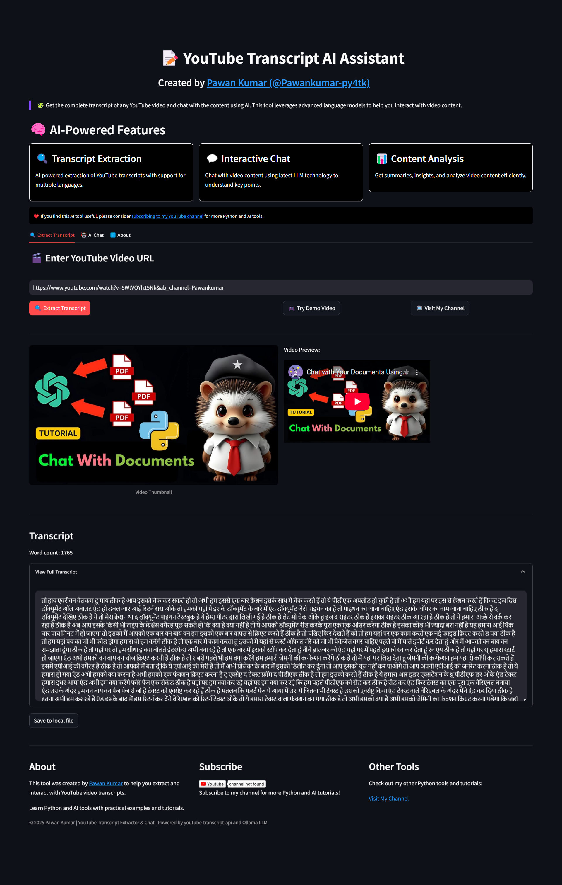

<div align="center">

# 📝 YouTube Transcript Extractor & Chat


<a href="https://www.youtube.com/@Pawankumar-py4tk?sub_confirmation=1"></a>

<p align="center">
  
</p>

<p>A powerful tool to extract transcripts from any YouTube video and chat with the content using AI 💬</p>
<p>Created by <a href="https://www.youtube.com/@Pawankumar-py4tk">@Pawankumar-py4tk</a></p>

</div>

---

## ✨ Live Demo

Try the tool online: [Launch App](#) *(Add your deployment link when available)*

<p align="center">
  
  <br><i>👆 Main interface of YouTube Transcript Extractor</i>
</p>

## 🌟 Features

<table>
<tr>
<td>

- ✅ **Extract Transcripts**: Get the complete transcript from any YouTube video with just a URL
- ✅ **Multiple Languages**: Support for transcripts in different languages and auto-generated captions
- ✅ **AI Chat Interface**: Ask questions about the video content and get answers based on the transcript
- ✅ **Download Options**: Save transcripts as text files for offline use
- ✅ **User-Friendly Interface**: Clean Streamlit web interface for easy interaction

</td>
<td>


</td>
</tr>
</table>

## 🚀 Installation

### Prerequisites
- Python 3.7+
- pip package manager

### Setup Instructions

1. **Clone the repository**
```bash
git clone https://github.com/yourusername/youtube-transcript-extractor.git
cd youtube-transcript-extractor
```

2. **Install required packages**
```bash
pip install -r requirements.txt
```

3. **Run the application**

Command line version:
```bash
python youtube.py
```

Streamlit web interface:
```bash
streamlit run streamlit_app.py
```

## 💻 Screenshots

<div align="center">
<table>
  <tr>
    <td width="50%">
      
      <p align="center"><i>Main interface - Transcript extraction</i></p>
    </td>
    <td width="50%">
      
      <p align="center"><i>AI Chat with transcript content</i></p>
    </td>
  </tr>
  <tr>
    <td colspan="2">
      
      <p align="center"><i>About section with creator information</i></p>
    </td>
  </tr>
</table>
</div>

## 🤖 AI Chat Feature

<table>
<tr>
<td width="60%">
The AI chat feature uses an Ollama-hosted LLM to answer questions based on the video transcript. You can:

- 💡 Ask for summaries of the video content
- 🔍 Query specific information mentioned in the video
- 📚 Request explanations of concepts discussed in the transcript
- 🔄 Get key points and timestamps from long videos
</td>
<td width="40%">

</td>
</tr>
</table>

## 🔧 Configuration

If you want to use a different LLM API, you can modify the following constants in `streamlit_app.py`:

```python
# Constants for Ollama API
OLLAMA_API_URL = "https://your-api-url.com/api/chat"
OLLAMA_MODEL = "your-model-name"
```

## 📁 Project Structure

```
youtube-transcript-extractor/
├── youtube.py               # Core functionality for transcript extraction
├── streamlit_app.py         # Streamlit web interface
├── requirements.txt         # Python dependencies
├── README.md                # Project documentation
├── screenshots/             # Application screenshots
│   ├── maininterfaceimage.png  # Main interface screenshot
│   ├── chatimag.png         # Chat interface screenshot
│   └── about.png            # About section screenshot
└── LICENSE                  # MIT License
```

## 📝 License

This project is licensed under the MIT License - see the [LICENSE](LICENSE) file for details.

## 👨‍💻 Author

<div align="center">
  <a href="https://www.youtube.com/@Pawankumar-py4tk">
    
  </a>
  <br>
  <a href="https://www.youtube.com/@Pawankumar-py4tk">
    
  </a>
</div>

<table>
  <tr>
    <td width="150" align="center">
      <a href="https://www.youtube.com/@Pawankumar-py4tk">
        
      </a>
    </td>
    <td>
      <h3><a href="https://www.youtube.com/@Pawankumar-py4tk">Pawan Kumar</a></h3>
      <p>I create Python tutorials and tools to help make programming and AI more accessible. Follow me for more useful content!</p>
      <p>
        <a href="https://www.youtube.com/@Pawankumar-py4tk?sub_confirmation=1">
          
        </a>
      </p>
    </td>
  </tr>
</table>

## 🙏 Acknowledgements

- [YouTube Transcript API](https://github.com/jdepoix/youtube-transcript-api) for making transcript extraction possible
- [Streamlit](https://streamlit.io/) for the web interface framework
- [Ollama](https://ollama.com/) for hosting the LLM service

## ⭐ Support

If you find this tool useful, please consider:
- 🌟 Giving it a star on GitHub
- 📺 [Subscribing to my YouTube channel](https://www.youtube.com/@Pawankumar-py4tk?sub_confirmation=1) for more Python tutorials
- 🔀 Contributing to the project with improvements and bug fixes

---

<div align="center">
  <a href="https://www.youtube.com/@Pawankumar-py4tk?sub_confirmation=1">
    
  </a>
</div>

<p align="center">
  <i>This tool uses the YouTube Transcript API and is not affiliated with YouTube or Google.<br>
  Use responsibly and in accordance with YouTube's terms of service.</i>
</p>
